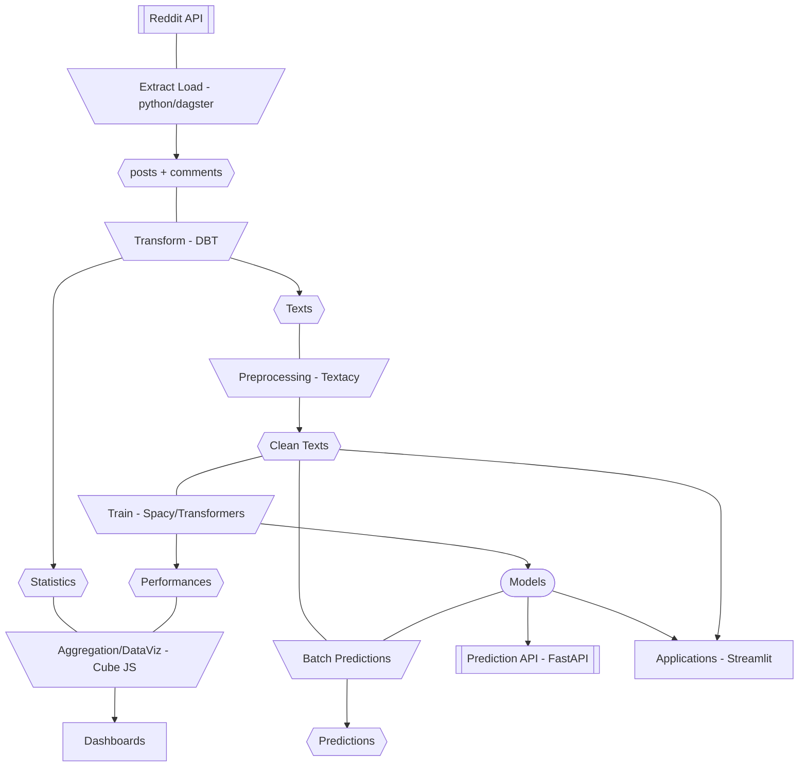
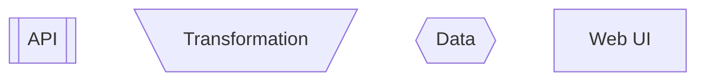

# My Reddit: an exploratory NLP project on reddit data
This is a demonstrator project of a fully featured NLP/ML system.

This project covers from data extraction to dashboarding to MLOps.

Legend:

## Architecture

## Features

### NLP Features
Implemented:
- Syntactic analysis with Spacy
- Topic Modeling with BERTopic
- Text classification with custom model

Coming Soon:
- Language detection
- Topic Modeling algorithm comparison

### Product
- A dashboard app based on cubeJS
- A frontend which integrates all administration web UIs
- Data collection on demand & on schedules
- Cloud Database (BigQuery)
- On demand & scheduled model training
- APIs to serve models
- MLOps for NLP with explainability
- Interactive Apps
