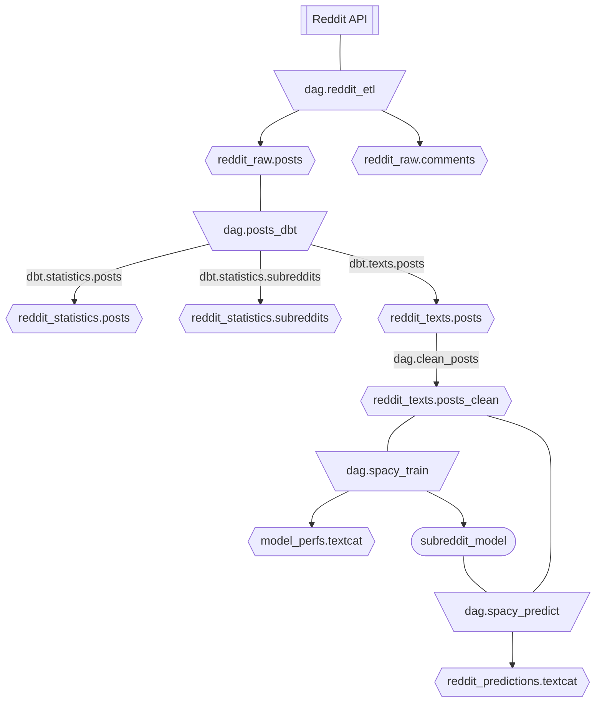

# Data Pipelines

## ETL & Data prep

```mermaid
flowchart TD
    %% EL[T]
    reddit[[Reddit API]] --- ETL[\dag.reddit_etl/]
    ETL --> posts{{reddit_raw.posts}}
    ETL --> comments{{reddit_raw.comments}}
    %% [EL]T DBT processes
    posts --- pdbt[\dag.posts_dbt/]
    pdbt -- dbt.statistics.posts --> pstats{{reddit_statistics.posts}}
    pdbt -- dbt.statistics.subreddits  --> sstats{{reddit_statistics.subreddits}}
    pdbt -- dbt.texts.posts --> ptxt{{reddit_texts.posts}}
    %% Clean texts
    ptxt -- dag.clean_posts --> pclean{{reddit_texts.posts_clean}}
    %% Subreddit prediction (trivial)
    txtcattr[\dag.spacy_train/] --> mptxtcat{{model_perfs.textcat}}
    pclean --- txtcattr --> srmodel([subreddit_model])
    pclean --- txtcatpr[\dag.spacy_predict/] --> prtxtcat{{reddit_predictions.textcat}}
    srmodel --- txtcatpr
```
